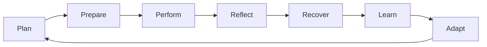
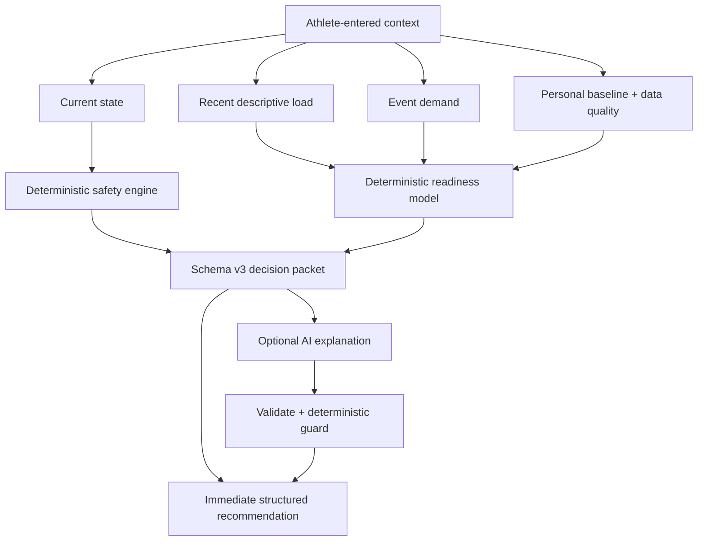

# Athlete Reload Architecture

## Product loop

Home is the daily decision surface, Schedule owns planned context, and History owns longitudinal reflection. Fuel, Recovery and Check-in support that loop rather than competing with it.

## Decision architecture

Safety, score, status, calculations, actions and warnings are deterministic. AI may improve explanation but may not override safety or invent calculated nutrition/hydration values. Missing logs remain unknown.

## Frontend boundaries

- `src/domain`: deterministic business rules with no React or Supabase dependency.
- `src/lib`: compatibility adapters and external-service clients.
- `src/repositories` and the evolving Supabase repository layer: persistence operations.
- `src/features/app`: athlete snapshot loading/controller extraction.
- `src/components`: current presentation layer; oversized feature views remain candidates for incremental decomposition.
- `src/App.jsx`: still the main application coordinator. It must continue shrinking toward auth/application state, navigation, active feature rendering and global dialogs only.

## Data ownership

Legacy tables are owned by `user_id`. New context tables are owned by an `athlete_id` and membership model so future parent/trainer access is possible without granting it now. Linked-record triggers and RLS validate ownership. Legal consent is append-only and durable.

## Compatibility rules

- Database changes are additive. Legacy columns remain during dual-read/write windows.
- Existing recommendation JSON remains readable by schema version.
- Existing under-16 records are not deleted or altered; they are restricted for remediation.
- Provider/model metadata is present only for AI-assisted recommendation records.

## Current versions

- Recommendation contract: 3.
- Deterministic recommendation engine: `deterministic-3.0.0`.
- Readiness model: `readiness-3.0.0`.
- Safety engine: `safety-3.0.0`.
- Recovery compatibility engine: `recovery-2.0.0`.
